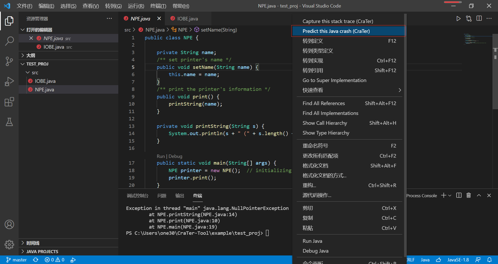

# VSCode - CraTer

**CraTer** 是一个 Java 程序故障定位工具。当一个程序崩溃后， CraTer 读入 Java 程序源代码以及相应的崩溃堆栈踪迹，预测崩溃根源代码行是否存在于堆栈踪迹中，并输出预测结果。

本插件由 **[顾咏丰](https://gu-youngfeng.github.io/)** 与 **[玄跻峰](http://jifeng-xuan.com/index_cn.html)** 开发。

## 使用说明

注意事项：
1. 在 Windows 平台下安装使用。
2. 运行 Java 程序时使用 Java 8 版本的 [JDK](https://www.oracle.com/java/technologies/javase/javase-jdk8-downloads.html)
3. 插件工作时，Java 源文件需要在 `src/` 目录下。如果工程通过 Maven 或 Gradle 构建，需要将代码复制到 `src/` 目录中。

首先在 VSCode 中运行目标 Java 程序\(需要其他插件\)，然后本插件从终端捕获堆栈踪迹，并预测崩溃根源。所有操作均从右键选项中选择。

具体使用步骤如下，

1. 在右键选项中选择 `Run` 。

2. 在右键选项中选择 `Capture this stack trace` 。

3. 在右键选项中选择 `Predict this Java crash` 。

4. CraTer生成的详细预测结果将在一个名为 `CraTer Result` 的新窗口中展示。

## 功能设置

本插件设置字段如下，

* `terminalCapture.enable`: 如果为 false ， 关闭终端捕获堆栈踪迹信息功能。
* `terminalCapture.useClipboard`: 如果为 false ，使用之前缓存的堆栈踪迹信息进行分析。

本插件命令字段如下，

* `crater.terminal`: 从终端捕获堆栈踪迹信息。
* `crater.predict`: 使用 CraTer 进行崩溃根源预测。

## 版本信息

### 0.0.4
更新 CraTer jar包与修改剪切板读取逻辑。

### 0.0.3

修复一些漏洞以及重构插件结构。

### 0.0.2

修复一些漏洞以及优化。

### 0.0.1

初始版本。
