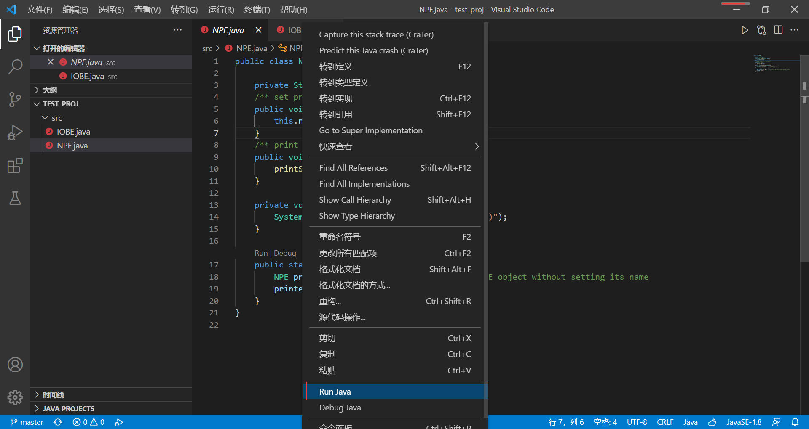
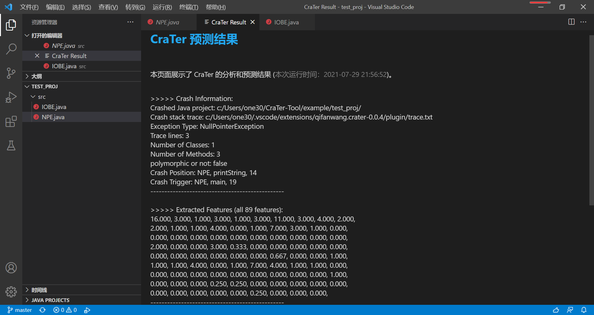

# VSCode - CraTer

## Introduction

**CraTer** is a light-weight fault localization extension for Java programs. 
Quite simply, when a program crashed, CraTer takes the Java program and corresponding crash stack trace as inputs and outputs whether or not the root-cause-line of the crash resides in the stack trace.

This extension is developered by **Yongfeng Gu** and **Jifeng Xuan**. 

## Usages

We first _run_ the faulty program in VS Code then _capture_ the stack trace from the Terminal. 
Finally, we _predict_ the position of the crash root cause. 
Note that All the actions are selected from the right-click prompt.
The main steps are as follows,

1. Select the `Run` in the right-click popup.

2. Select the `Capture this stack trace` in the right-click popup.

3. Select the `Predict this Java crash` in the right-click popup.

4. The detailed prediction results of CraTer is displayed in a new Webview window named `CraTer Result`.

## Extension Settings

This extension contributes the following settings:

* `crater.terminal`: capture the stack trace from the terminal
* `crater.predict`: use CraTer to make predictions

## Known Issues

At this time, it is known that CraTer has the following issues:

- CraTer only supports analyzing crashes of Java language, and other program languages will be supported in the next versions.
- CraTer only focus on analyzing the code in the `src/` folder of your Java project. Hence, if your projects are built by Maven or Gradle, try to copy your code in the `src/` folder.
- CraTer cannot analyze the 3rd-party libraries in the stack trace and may miss some valuable information about crashes, resulting in inaccurate prediction results or runtime crashes.

## Release Notes

### 0.0.3

Fix some bugs and reconstruct the architecture of the extesion

### 0.0.2

Fix some bugs and optimize the CraTer results.

### 0.0.1

The initial release of CraTer which only focus on analyzing the Java crashes.
